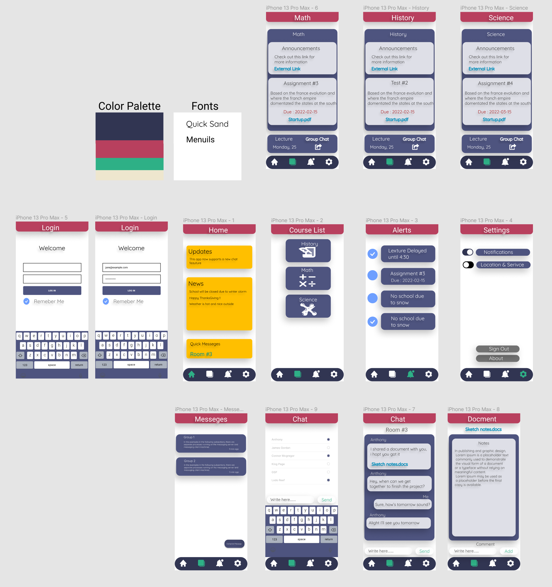

# Classroom-Hub
An application protoype desgin for HCI - Info31179 This prototype was desgined in Figma, it's meant to illusrtate how an online classroom app for sutdents and teachers works.

<!-- PROJECT LOGO -->
 

  <h3 align="center">Classroom App</h3>

  

    A protoype design of an application  desgin for INFO31179
     
  

<!-- ABOUT THE PROJECT -->
## About The Project

 <h3 align="center">Prototype Design #2</h3>
 

For the teachers: 
* easy access to student progress
* be able to upload schoolwork and set deadlines
* interact with students better through group chats and messages

For the students:
* see work and due date better
*	get notification on upcoming events
*	be able to interact with all participants of class or school

<!-- ROADMAP -->
## Roadmap

- [x] Idea
- [x] Needfinding
- [x] Competitive Analysis
    - [x] Version 1
    - [x] Version 2
    - [ ] Version 3

(<a href="#top">back to top</a>)

<!-- MARKDOWN LINKS & IMAGES -->
[Screenshot-V3]: ScreenshotV3.png
[Screenshot-V2]: ScreenshotV2.png
[Screenshot-V1]: ScreenshotV1.png 
